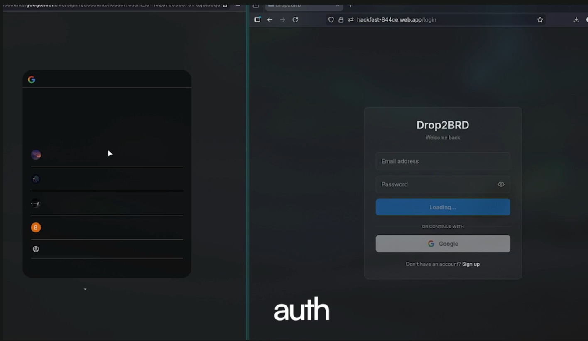
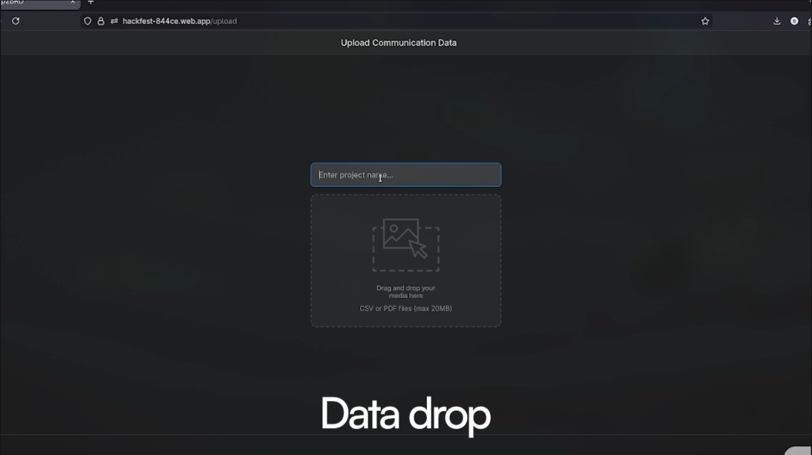
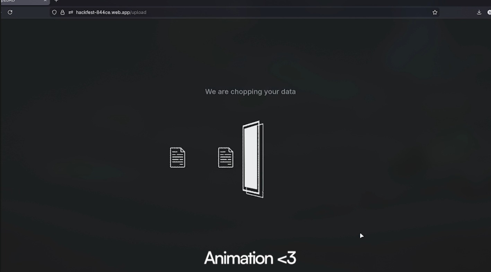
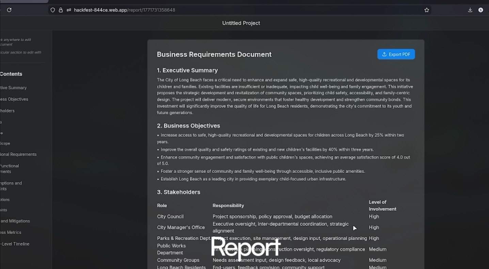

# Drop2BRD 🚀

**AI-Powered Business Requirements Document Generator**

Transform scattered communication data (emails, transcripts, CSVs, PDFs) into professional, enterprise-grade Business Requirements Documents in minutes.

[](https://hackfest-844ce.web.app)
[](LICENSE)

---

## 📹 Demo Video

https://github.com/user-attachments/assets/2cbbd57b-a811-4157-9a88-50aae34d24fb

---

## 📸 Screenshots

### Authentication

*Secure login with Google OAuth and Email/Password*

### File Upload

*Drag & drop multiple CSV/PDF files with validation*

### Loading Animation

*Animated messages during BRD generation*

### BRD Report

*Professional BRD with table of contents and rich editing*

---

## 🎯 Problem Statement

Organizations struggle to create professional Business Requirements Documents from scattered communication data. Manual BRD creation is time-consuming, inconsistent, and error-prone. Drop2BRD automates this process using AI, reducing documentation time by 80%.

---

## ✨ Features

### 🤖 AI-Powered Generation
- **Google Gemini 2.5 Flash** for intelligent BRD generation
- **10-Section Structure**: Executive Summary, Business Objectives, Stakeholders, Scope, Requirements, etc.
- **Smart Sampling**: Processes 33K+ chunks, samples 10 for optimal results

### 📁 Multi-Source Input
- **CSV Files**: Schema-agnostic parsing
- **PDF Documents**: Text extraction with pdf-parse-fork
- **Drag & Drop**: Intuitive file upload interface
- **Multi-File Support**: Upload multiple files at once (20MB limit each)

### 🎨 Rich Editing
- **Double-Click to Edit**: Instant markdown editor
- **SimpleMDE Integration**: Professional markdown editing with live preview
- **Auto-Save**: Changes saved to Firestore in real-time
- **Table of Contents**: Auto-generated from headings with smooth scroll

### 🔐 Secure Authentication
- **Firebase Auth**: Google OAuth + Email/Password
- **User Isolation**: Each user's data is completely separate
- **JWT Tokens**: Secure API authentication
- **Protected Routes**: All features require authentication

### 📤 Professional Export
- **PDF Export**: One-click professional PDF generation
- **Formatted Output**: Clean, readable documents
- **Custom Title**: Auto-adds "Business Requirements Document" header

### 🎯 Project Management
- **Dashboard**: View all your BRD projects
- **Rename/Delete**: Easy project management
- **Search**: Filter projects by name
- **Workspaces**: Organize projects into workspaces

---

## 🏗️ Architecture

### Tech Stack

**Frontend:**
- React 19 + Vite
- Tailwind CSS (Dark Theme)
- Firebase Authentication
- React Router
- SimpleMDE (Markdown Editor)
- Deployed on Firebase Hosting

**Backend:**
- Node.js + Express
- Google Gemini 2.5 Flash API
- Firebase Admin SDK
- Firestore Database
- In-Memory Chunk Processing

**Infrastructure:**
- Firebase Hosting (Frontend)
- ngrok Tunnel (Backend)
- Firestore (Database)

---

## 🚀 Getting Started

### Prerequisites
- Node.js 18+
- Firebase Account
- Google Gemini API Key
- ngrok Account (for production)

### Installation

1. **Clone the repository**
```bash
git clone https://github.com/realSUDO/Drop2BRD.git
cd Drop2BRD
```

2. **Setup Backend**
```bash
cd backend
npm install

# Create .env file
cat > .env << EOF
GEMINI_API_KEY=your_gemini_api_key_here
FIREBASE_PROJECT_ID=your_project_id
FIREBASE_CLIENT_EMAIL=your_client_email
FIREBASE_PRIVATE_KEY="your_private_key"
EOF

# Add Firebase service account key
# Download from Firebase Console and save as serviceAccountKey.json
```

3. **Setup Frontend**
```bash
cd ../frontend
npm install

# Update src/firebase.js with your Firebase config
```

4. **Run Locally**
```bash
# Terminal 1 - Backend
cd backend
npm start

# Terminal 2 - Frontend
cd frontend
npm run dev
```

Visit `http://localhost:5173`

---

## 🌐 Deployment

### Frontend (Firebase Hosting)
```bash
cd frontend
npm run build
firebase deploy --only hosting
```

### Backend (ngrok Tunnel)
```bash
# Get ngrok auth token from https://dashboard.ngrok.com
ngrok config add-authtoken YOUR_TOKEN

# Start tunnel
ngrok http 3001

# Update frontend/src/services/api.js with ngrok URL
```

---

## 📊 Data Flow

```
Upload Files → Extract Text → Chunk & Filter → Sample 10 Chunks →
Generate BRD (Gemini) → Save to Firestore → Display with TOC →
Edit (Optional) → Export to PDF
```

### Processing Pipeline
1. **Extract**: Schema-agnostic CSV, PDF text extraction
2. **Normalize**: Clean whitespace, lowercase
3. **Chunk**: Semantic chunking (2-3 sentences)
4. **Filter**: Keyword-based relevance filtering
5. **Sample**: 10 evenly distributed chunks
6. **Generate**: Gemini API with structured prompt
7. **Store**: Only final BRD in Firestore (chunks in memory)

---

## 🎨 UI/UX Highlights

### Dark Theme
- Background: `#1E1E1E`
- Surface: `#2A2A2A`
- Border: `#3D3D3D`
- Text: `#B0B0B0`
- Selection: `#4D4D4D`

### Animations
- Fade in/out loading messages
- Smooth scroll navigation
- Hover transitions
- Loading skeletons

### Responsive Design
- Collapsible sidebar (309px)
- TOC sidebar (280px)
- Mobile-friendly layout
- Max content width: 1024px

---

## 🔒 Security

- Firebase Authentication with JWT tokens
- User-specific data isolation in Firestore
- Service account key gitignored
- CORS configured for allowed origins
- Environment variables for sensitive data

---

## 📈 Performance

- **Generation Time**: 10-30 seconds
- **File Processing**: <5 seconds for 20MB files
- **Page Load**: <2 seconds (Firebase CDN)
- **Success Rate**: ~95%
- **Chunk Handling**: 33K+ chunks in memory

---

## 🐛 Known Issues

- Backend requires local hosting or ngrok tunnel
- ngrok free tier URL changes on restart
- Firestore rules in development mode (allow all)
- No BRD version history yet

---

## 🛣️ Roadmap

### Priority 1 (MVP+)
- [ ] Backend deployment (Firebase Functions)
- [ ] Production Firestore security rules
- [ ] BRD version history
- [ ] Export to DOCX format
- [ ] Custom BRD templates

### Priority 2 (Growth)
- [ ] Collaborative editing (real-time)
- [ ] Comments and annotations
- [ ] AI-powered section editing
- [ ] Integration with Jira/Confluence
- [ ] Team workspaces

### Priority 3 (Scale)
- [ ] API for developers
- [ ] Custom AI model fine-tuning
- [ ] Multi-language support
- [ ] Advanced analytics dashboard
- [ ] White-label solution

---

## 🤝 Contributing

Contributions are welcome! Please feel free to submit a Pull Request.

1. Fork the repository
2. Create your feature branch (`git checkout -b feature/AmazingFeature`)
3. Commit your changes (`git commit -m 'Add some AmazingFeature'`)
4. Push to the branch (`git push origin feature/AmazingFeature`)
5. Open a Pull Request

---

## 📝 License

This project is licensed under the MIT License - see the [LICENSE](LICENSE) file for details.

---

## 👥 Team

Built with ❤️ by Team SSD for Hackfest 2.0

---

## 🙏 Acknowledgments

- Google Gemini for AI capabilities
- Firebase for backend infrastructure
- ngrok for secure tunneling
- md-to-pdf.fly.dev for PDF generation

---

## 📧 Contact

For questions or support, please open an issue on GitHub.

**Live Demo:** [https://hackfest-844ce.web.app](https://hackfest-844ce.web.app)

**GitHub:** [https://github.com/realSUDO/Drop2BRD](https://github.com/realSUDO/Drop2BRD)
